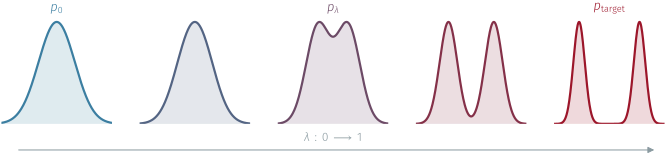
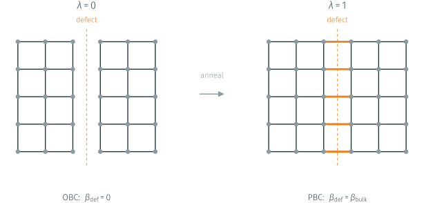
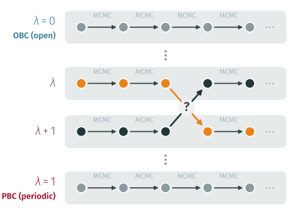
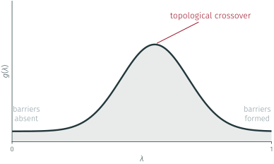
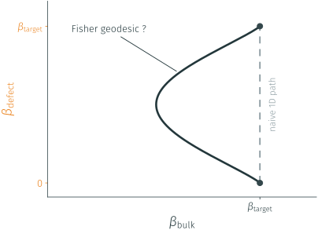
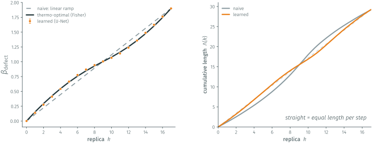
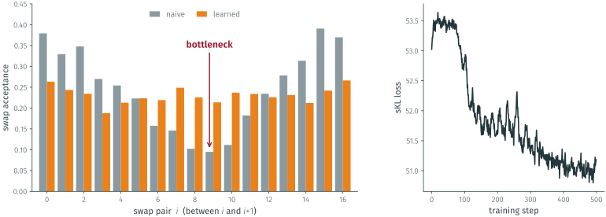
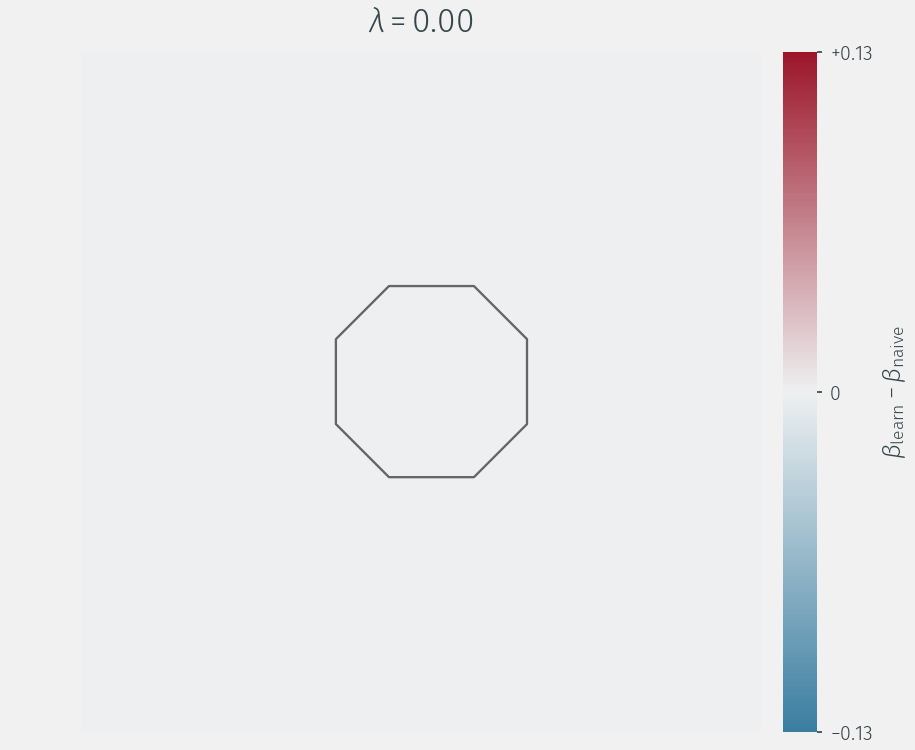

## Two flavors of critical slowing down

:::: {.columns}
::: {.column width="42%"}

::: {.fragment fragment-index=0 style="margin-top:90px"}
Standard critical slowing down:

$$\tau_{\mathrm{int}}(\mathcal{O}) \;\sim\; a^{-z}$$

:::

::: {.fragment fragment-index=1}
Topological freezing:

$$\tau_{\mathrm{int}}(Q^2) \;\sim\; e^{\,c/a}$$
:::


:::
::: {.column width="58%"}



:::
::::

::: {class="fragment" fragment-index=2 style="margin-top:-75px"}
- Topology underlies key QCD phenomena:
  - Witten–Veneziano mechanism → $m_{\eta'~}$
  - Strong-CP problem ($\theta$-term)
  - QCD thermodynamics
:::


::: {class="fragment" fragment-index=3 style="font-size:1.0em; font-style:italic; color:gray; margin-top:-50px; margin-left:58%; text-align:left;"}
Why sampling [**Topology**]{style="color: #EB811B;"} is so [**difficult**]{style="color: #EB811B;"}?
:::


## Where the exponential comes from

:::: {.columns}
::: {.column style="width:58%; margin-top:1em"}



:::
::: {.column width="42%"}

::: {class="fragment" fragment-index=0 style="margin-top:0em; font-size:0.85em; text-align:center;"}

<div style="font-size:1em; text-align:center;"> **Particle on a ring**
</div> 
<div style="margin-top:0.5em;">
</div>

$x(\tau): S^1_\tau \rightarrow S^1_x$

<div style="margin-top:1.1em;">
</div>
The path integral splits into **homotopy sectors** by winding number
$Q\in\mathbb{Z}$:

$$Z \;=\; \sum_{Q} Z_Q$$
:::

::: {class="fragment" fragment-index=3 style="margin-top:1.4em; font-size:0.85em; text-align:center;"}
<div style="font-size:1em; text-align:center;">**Local Algorithms:** </div>
Constant acceptance ⇒  $\delta x \sim \sqrt{a}$.
:::


:::
::::

::: {.fragment fragment-index=4}

::: {.lead style="text-align:center; margin:0.15em auto 0.1em; max-width:94%; font-size:1.0em; margin-top:1.5em"}
 Topology changes
require crossing an action barrier $\Delta S \sim c/a$
:::

::: {.eqbox style="display:block; width:max-content; margin:0.1em auto; text-align:center"}
$P_{\mathrm{tunnel}} \sim e^{-\Delta S} \quad\Longrightarrow\quad
 \tau_{\mathrm{int}}(Q) \sim e^{\,\Delta S} \sim e^{\,c/a}$
:::

:::

::: {.notes}
Particle on a ring: the path integral splits into homotopy classes labelled by the
winding number Q (pi_1(S^1) = Z); the two boxes are the Q=0 and Q=+1 sectors. Local
Monte Carlo at fixed acceptance proposes path changes of order sqrt(a). Changing Q
needs a defect -- one link with Dphi ~ pi -- costing DS ~ 1/a ~ 2 beta-tilde, a
barrier that diverges in the continuum. Tunnelling is suppressed as e^{-DS}, so
tau_top ~ e^{c/a}. Same mechanism in CP^(N-1) and QCD.
:::

## Fighting freezing = choosing an annealing protocol 

$$S_\lambda = (1-\lambda)\,S_0 + \lambda\,S_{\mathrm{target}}  \;\Longrightarrow \; p_\lambda \sim e^{-S_\lambda} $$



:::: {.columns}
::: {.column width="50%"}

::: {.fragment style="text-align:center"}
**Learned sequential flows**

- NETS / Stochastic Normalizing Flows;
- **sequential** learned steps along $\lambda$.
:::


:::
::: {.column width="50%"}

::: {.fragment style="text-align:center"}
**Parallel tempering**

- E.g. anneal a **defect coupling**; 
- **parallel** replicas exchanged along $\lambda$.
:::

:::
::::

## Fighting freezing = choosing an annealing protocol 

$$S_\lambda = (1-\lambda)\,S_0 + \lambda\,S_{\mathrm{target}}  \;\Longrightarrow \; p_\lambda \sim e^{-S_\lambda} $$


:::: {.columns}
::: {.column width="50%"}

::: {style="text-align:center; opacity:0.4"}
**Learned sequential flows**

- NETS / Stochastic Normalizing Flows;
- **sequential** learned steps along $\lambda$.
:::


:::
::: {.column width="50%"}

::: {style="text-align:center; border:3px dashed #EB811B; border-radius:10px; padding:0.4em 0.8em; background:rgba(235, 128, 27, 0.09)"}
**Parallel tempering**

- E.g. anneal a **defect coupling**;
- **parallel** replicas exchanged along $\lambda$.
:::

:::
::::

## The testbed: 2D $CP(N-1)$

::: {.fragment style="text-align:center; font-size:0.88em; margin-top:-0.6em;"}
A QCD-like toy model </br><span style="margin-top: 0.3em;"> asymptotic freedom, a mass gap, $\theta$-vacua, and the
**same topological freezing** </span>
:::
::: {.fragment style="text-align:center; font-size:0.88em; margin-top:-0.1em; color: #8a8a8a;"}
at a fraction of the cost.
:::


:::: {.columns}
::: {.column width="54%"}

::: {.fragment style="margin-top:0.0em;"}

**Fundamental field:** a unit complex $N$-vector

$$z(x)\in\mathbb{C}^N,\qquad z^{\dagger}(x)\,z(x)=1$$

with a local $U(1)$ **gauge redundancy**

$$z(x)\;\longrightarrow\;e^{i\alpha(x)}\,z(x)$$
:::

::: {.fragment style="margin-top:0.9em;"}
**Lattice action:**

$$S=-2N\beta\sum_{x,\mu}\mathrm{Re}\!\big[z^{\dagger}_x\,U_{x,\mu}\,z_{x+\hat\mu}\big]$$

:::

:::
::: {.column width="46%"}

::: {.fragment style="margin-top:0.0em;"}
**Nontrivial topology:**

$$\pi_2\!\big(CP^{N-1}\big)=\mathbb{Z}$$


<span style="margin-top:1.5em; display:block;">Each configuration carries an **integer topological charge**</span>


::: {.eqbox style="display:block; text-align:center; margin-top:1.3em"}
$$Q=\frac{1}{2\pi}\!\int\! d^2x\;\epsilon_{\mu\nu}\,\partial_\mu A_\nu\;\in\;\mathbb{Z}$$
:::
:::


:::
::::

## Annealing the boundary: a tunable defect

:::: {.columns}

::: {.column width="50%"}

::: {.lead style="text-align:center; margin-bottom:0.0em"}
**Open** BC </br>
No Topological barriers and $Q$ change freely
:::

:::
::: {.column width="50%"}

::: {.lead style="text-align:center; margin-bottom:0.0em"}
**Periodic** BC </br>
Target Physical Theory but topology is frozen!
:::

:::

::::




::: {.lead style="text-align:center; margin-top:0.1em"}
The **defect** is a line of links (a cut) with tunable coupling. 

Anneal
$\;\beta_{\mathrm{def}}(\lambda)=\lambda\,\beta_{\mathrm{bulk}}$: at $\lambda=0$ the cut is
open; at $\lambda=1$ we recover the periodic theory.
:::

## Parallel tempering: a ladder of replicas

::: {class="lead" style="font-size:1em; text-align:center; margin-top:0.0em"}
$N_R$ replicas with fixed couplings $\lambda_0=0\; ,\dots, \;\lambda_{N_R-1}=1$ run **in
parallel**

:::

:::: {.columns}
::: {.column width="54%"}

{style="max-height:64vh; margin-top:0.5em"}

:::
::: {.column width="46%"}

::: {class="fragment" style="font-size:0.9em; margin-top:3.5em"}

1. **local MC** in each replica samples its own $p_\lambda$;
2. Propose a configuration **swap** between **adjacent** replicas 

3. **Accept/Reject** $\Longrightarrow$ detailed balance :

::: {.eqbox style="display:block; width:max-content; margin:0.25em auto; text-align:center"}
$A=\min\!\big(1,\;\frac{p_{\lambda}(x_{\lambda+1})\, p_{\lambda+1}(x_{\lambda})}{p_{\lambda}(x_{\lambda})\, p_{\lambda+1}(x_{\lambda+1})}\big)$
:::

:::


:::
::::


::: {.fragment style="text-align:center; margin-top:1.1em"}
 **Efficient** PT ladder $\Longrightarrow$ **topological mixing** from the open replica to the [**target**]{style="color: #EB811B;"} periodic one. 

:::

## Efficiency is a geometry problem


::: {.fragment fragment-index="0" style="text-align:center; margin-top:1.1em"}
Given a fixed budget of steps / replicas, **where should they go?**
:::



::: {.fragment style="text-align:center; margin-top:2.1em"}

The answer comes from **Information Geometry** by studying the [**Fisher metric**]{style="color: #EB811B;"} 

:::


## Information geometry gives the answer

::: {.fragment style="text-align:center; font-size:0.89em; margin-bottom:0.1em"}
The space of probability distributions is a **smooth manifold**, carrying a natural
metric $\Rightarrow$ the [**Fisher metric**]{style="color: #EB811B;"}:

$$g(\lambda) \;=\; \mathbb{E}_{p_\lambda}\!\Big[\big(\partial_\lambda \log p_\lambda\big)^2\Big]$$

:::

:::: {.columns}
::: {.column width="55%"}

:::{.fragment style="text-align:left; margin-top:0.0em;"}

For Boltzmann like $p_\lambda \propto e^{-S_\lambda}$

$$\partial_\lambda \log p_\lambda \;=\; -\,\partial_\lambda S_\lambda \;+\; \langle \partial_\lambda S_\lambda\rangle_{p_\lambda}$$

so the metric is just a **variance**:

::: {.eqbox style="display:block; width:max-content; margin:0.3em auto; text-align:center"}
$g(\lambda) \;=\; \mathrm{Var}_{p_\lambda}\!\big[\partial_\lambda S_\lambda\big]$
:::

:::


:::
::: {.column width="45%"}


::: {.fragment style="text-align:left; margin-top:0.0em;"}
**… and a distance**

Second-order expansion of the KL divergence:

$$D_{\mathrm{KL}}\big(p_\lambda \,\|\, p_{\lambda+d\lambda}\big) \;\simeq\; \tfrac{1}{2}\, g(\lambda)\, d\lambda^2$$

:::

:::
::::


:::{.fragment style="text-align:center; margin-top:2.0em;"}

$g(\lambda)$ $\Rightarrow$ **local distinguishability** of nearby distributions
:::

::: {.fragment style="margin-top:0.6em"}
::: {style="display:flex; justify-content:center; align-items:stretch; gap:1.6em; font-size:0.8em"}
[**large $g$** $\Rightarrow p_\lambda$ moves fast, *hard to bridge*]{style="display:inline-block; border:1.6px solid #9c162a; background:rgba(156,22,42,0.07); border-radius:8px; padding:0.45em 1.1em; color:#9c162a"} 
[**small $g$**  $\Rightarrow p_\lambda$ barely moves, *easy*]{style="display:inline-block; border:1.6px solid #3b7ea1; background:rgba(59,126,161,0.07); border-radius:8px; padding:0.45em 1.1em; color:#3b7ea1"}
:::
:::


## The geodesic condition

:::: {.columns}
::: {.column style="width:54%; font-size:0.82em"}

**Thermodynamic length** </br>
Fisher metric turns the path into a distance:

$$\Lambda \;=\; \int_0^1 \!\sqrt{g(\lambda)}\,d\lambda \left(=\; \sum_k \Delta\ell_k \right) $$

Running it in a finite (fictitious) time $\tau$ **dissipates work**

$$W_{\mathrm{diss}}
\;\propto\; \frac{1}{\Delta t}\sum_k \Delta\ell_k^{\,2}$$

**Minimize $W_{\mathrm{diss}}$ at fixed length $\Lambda$** leads to

$$\Delta\ell_1 \;=\; \Delta\ell_2 \;=\; \cdots \;=\; \Delta\ell_N .$$


::: {.fragment .eqbox style="display:block; width:max-content; margin:0.5em auto; text-align:center"}
$\Delta\ell_k = \dfrac{\Lambda}{N} = \text{const}
\;\;\Longleftrightarrow\;\; \dfrac{d\lambda}{dt}\propto\dfrac{1}{\sqrt{g(\lambda)}}$
:::


:::
::: {.column width="46%"}




::: {.fragment style="text-align:left; margin-top:2.3em; font-size:0.86em; margin-left:3.5em"}
**The geodesic condition**: 

1. Equidistribute the thermodynamic length

2. Spend more steps
**where $g$ is large**, fewer where it is small.
:::


:::
::::

## The protocol doesn't have to be one-dimensional

:::: {.columns}
::: {.column width="45%"}



:::
::: {.column style="width:55%; font-size:0.9em"}

::: {.fragment}
1. Let the **bulk coupling** vary along the path too:

$$g_{ij} \;=\; \mathrm{Cov}_{p}\!\big[\partial_{\beta_i} S,\; \partial_{\beta_j} S\big]$$

Optimal protocol $\Rightarrow$ **geodesic** in the
$(\beta_{\mathrm{bulk}},\,\beta_{\mathrm{defect}})$ plane.
:::

::: {.fragment style="margin-top:1em"}
2. The defect is **local**: it breaks translation invariance

Why hold every site to the same coupling?

Let it vary in **space** too:

::: {.eqbox style="display:block; width:max-content; margin:0.35em auto; text-align:center"}
$\beta \;\longrightarrow\; \beta(x,y,t)$
:::
:::

:::
::::

## Learning the spatial coupling field

:::: {.columns}
::: {.column style="width:50%; font-size:0.88em"}

**1 · Parametrize the field**

::: {.flow}
[$d(x,y)$]{.box} [→]{.arrow} [U-Net]{.box .net} [→]{.arrow} [$F(x,y,\lambda)$]{.box}
:::

$$\beta(x,y,\lambda) = \beta_{\mathrm{base}} + C_{\max}\,F(x,y,\lambda)\,\sin(\pi \lambda)$$

::: {.fragment style="margin-top:2.0em"}
- $\sin(\pi \lambda)$ **pins the endpoints** $\lambda=0,1$;
- the net sees only **geometry** — distance to the defect, *never field
  configurations* $\Rightarrow$ **transferable** 
:::

:::
::: {.column style="width:50%; font-size:0.88em"}

**2 · The loss is the geometry**

$$\begin{aligned}
\mathrm{sKL}(p_r, p_{r+1}) &= \tfrac{1}{2}\big[\,D_{\mathrm{KL}}(p_r \,\|\, p_{r+1}) + D_{\mathrm{KL}}(p_{r+1} \,\|\, p_r)\,\big] \\[3pt]
&= \tfrac{1}{2}\big[\langle \Delta S\rangle_{p_r} - \langle \Delta S\rangle_{p_{r+1}}\big]
\end{aligned}$$

::: {.fragment style="margin-top:2.3em"}
- Minimizing sKL between adjacent replicas **is** the discretized geodesic condition
- straight from **PT samples**, no partition function.
:::


:::
::::

```{=html}
<div class="loop fragment" style="margin-top:2.5em">
  <div class="box">Parallel tempering<br>sampling</div>
  <div class="exchange">
    <div>\(\beta(x,y,\lambda)\) &rarr;</div>
    <div>&larr; \(\nabla\,\mathrm{sKL}\)</div>
  </div>
  <div class="box">Network<br>update</div>
</div>
```


::: {.fragment .lead style="text-align:center; margin-top:1.4em"}
The U‑Net learns the **Fisher geodesic** end‑to‑end from PT samples — does its
trajectory match the theory?
:::


## The model finds the geometry {.money}



::: {.fragment .lead style="text-align:center; margin-top:0.3em; font-size:0.72em"}

Define phsical parameters used for this experiment 


The learned schedule lands on the **measured** Fisher optimum *(left)* and walks the
same path at **equal thermodynamic length per step** *(right)* the geodesic
condition recovered from samples alone.
:::

## Solved bottleneck ladder (tbd ?)



::: {.fragment .lead style="text-align:center; margin-top:0.3em; font-size:0.72em"}

**Put few words here**
:::

## A field of coupling

:::: {.columns}
::: {.column width="54%"}



:::
::: {.column style="width:46%; font-size:0.92em"}

The U-Net emits a full field $\beta(x,y,\lambda)$, not a scalar schedule. The residual
it carves, $\beta_{\text{learned}}-\beta_{\text{naive}}$:

::: {.fragment style="margin-top:0.8em"}
**Explain a lil bit **
:::

::: {.fragment .lead style="text-align:center; margin-top:1.3em"}
Freedom no scalar schedule has.
:::

:::
::::

## To be added

1. Results of the scaling with Physical volume of Topo observables

2. Scaling of the prefactor Linear vs Optimized 

3. Advantages of the optimal schedule 


## Thank you {.center}

::: {.lead}

Questions?
:::
